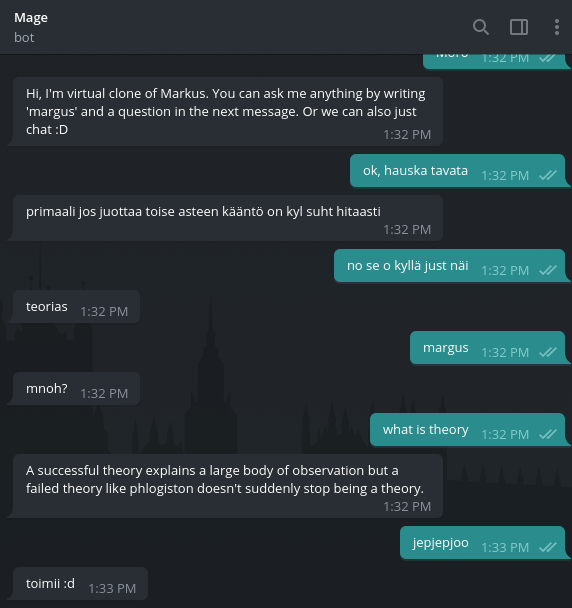

# mage-bot

This is my clone on Telegram. You can find it with nickname `@TyrkkomBot`.

## What does it do?

It has two functionalities, first of all it creates authentic chat messages based on my personal Telegram chat messages. It will answer to every message you send it by generating
an authentic sentence that is most likely something that I could say.

The second function is the search, which is invoked by sending message "margus" followed by another message with the question. The bot then sends a summarized answer to the question.

There is also help available by sending 'hi' or something similar to the bot.

## Why did it do this?

Well, I have this one friend who always asks me questions about everything. I usually search the answer online and post it to him and I thought that I might just as well outsource this duty to a bot. Then I considered that I could actually outsource the entire conversation to the bot so that I wouldn't need to chat with people anymore, win/win :D

## How did I do this?

The search functionality is based on scraping results from Quora, therefore it does not exactly work quite well. The longest answer is then summarized with text summarizer and sent to the user.

The chatting is based on markov chains and I dumped my entire message history including several thousand messages to create the model. I used [telegram-history-dump](https://github.com/tvdstaaij/telegram-history-dump) for dumping the messages and a custom parser `parser.py` to parse the raw data. The model itself is not included in GitHub for privacy purposes.

## External dependencies

I had to fork [quora-api](https://github.com/CodeDotJS/quora-api) because it was no longer being developed and it was broken. The same thing I had to do with [nodejs-text-summarizer](https://github.com/anpandu/nodejs-text-summarizer) since there was some bug with its dependency.
